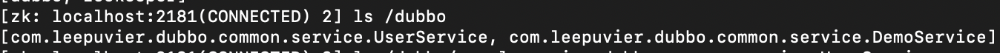
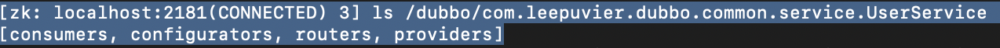
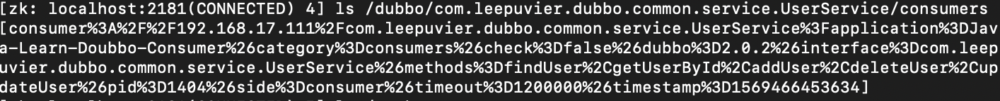
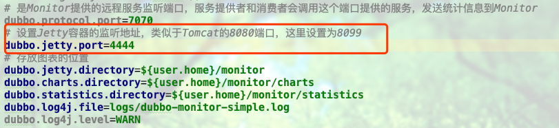
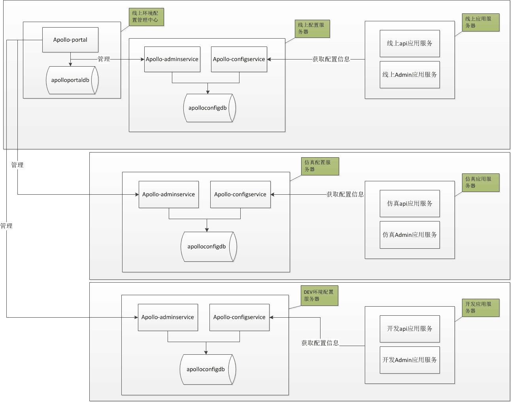
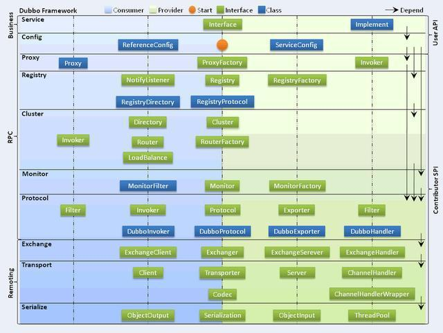

# Java-Dubbo-ZookeeperSpring-Mybatis
Java-Dubbo-ZookeeperSpring-Mybatis

参考地址: <u> https://www.cnblogs.com/gaopengfirst/p/9555240.html </u>

# 一、ZooKeeper

- - -

# 二、Mysql

- - -

# 三、Redis

- - -

# 四、配置

- - -

# 五、zooKeeper命令行

## 1. 进入根目录/bin 
    
## 2. ./zkCli.sh -server IP:Port
    
## 3. 查看指定内容

- ls /
 
>
    
- ls /dubbo
   
>

- ls /dubbo/com.leepuvier.dubbo.common.service.UserService
   
>  

- ls /dubbo/com.leepuvier.dubbo.common.service.UserService/consumers
    
> 
  
- ls /dubbo/com.leepuvier.dubbo.common.service.UserService/providers
       
- ls /dubbo/com.leepuvier.dubbo.common.service.UserService/routers
       
- ls /dubbo/com.leepuvier.dubbo.common.service.UserService/configurators
   
- ls /zookeeper
    
- - -

# 六、Telnet连接Dubbo服务

## 常用命令

- 连接服务：telnet 127.0.0.1 20880

- 查看服务列表：ls

- 查看服务中的接口：ls **Service

- invoke调用服务接口：invoke 接口名称(Json格式出入参数)

# 七、SpringBoot 打包

- 新增配置代码块，位置：provider、consumer-pom.xml
   ```
   <plugin>
       <groupId>org.springframework.boot</groupId>
       <artifactId>spring-boot-maven-plugin</artifactId>
       <configuration>
           <executable>true</executable>
       </configuration>
   </plugin>
   ```
# 八、Dubbo Admin

- 参考文档：Dubbo Admin (https://github.com/apache/dubbo-admin/blob/develop/README_ZH.md)

- 下载源码：git clone https://github.com/apache/dubbo-admin.git

  - 修改Dubbo Admin 控制台端口号，默认为8080，容易与其他服务冲突
    - dubbo-admin-server/src/main/resources/application.properties

    - 新增：server.port=****

- ZooKeeper 端口号修改，2种方式：
    
       （1） zookeeper目录 /conf/zoo.cfg 中新增：admin.serverPort=没有被占用的端口号
       
       （2） 启动脚本中增加 -Dzookeeper.admin.serverPort=没有被占用的端口号
       
- dubbo-admin-develop目录下，执行 mvn clean package -Dmaven.test.skip=true

- 启动，2种方式：

       （1） mvn --projects dubbo-admin-server spring-boot:run
        
       （2） cd dubbo-admin-distribution/target； java -jar dubbo-admin-0.1.jar
       
- 访问，http://localhost:${修改Dubbo Admin 控制台端口号}    

# 九、Dubbo Monitor

- 参考链接（https://blog.csdn.net/fly910905/article/details/86476546）

- 参考链接（https://github.com/apache/dubbo-admin/wiki/Dubbo-2.7）

- 下载dubbo-monitor-simple（）

- dubbo-monitor-simple,dubbo.properties配置

>    

- cd dubbo-monitor-simple，执行：mvn clean install -Dmaven.test.skip=true

- cd dubbo-monitor-simple/target, 复制 dubbo-monitor-simple-2.0.0-assembly.tar.gz 至其他目录解压

- cd 解压后目录，sh start.sh start

- 访问地址：http://localhost:4444，监控服务启动成功

- 项目服务提供方、消费方，*.xml新增配置：<dubbo:monitor protocol="registry"></dubbo:monitor>

# 十、Dubbo Apollo SpringBoot

>DEV：开发环境

>FAT：测试环境，相当于alpha环境(功能测试)

>UAT：集成环境，相当于beta环境（回归测试）

>PRO：生产环境

- 样例部署图

>

# 十一、Dubbo 工作原理

>

- 调用关系说明
- 服务容器负责启动，加载，运行服务提供者。
- 服务提供者在启动时，向注册中心注册自己提供的服务。
- 服务消费者在启动时，向注册中心订阅自己所需的服务。
- 注册中心返回服务提供者地址列表给消费者，如果有变更，注册中心将基于长连接推送变更数据给消费者。
- 服务消费者，从提供者地址列表中，基于软负载均衡算法，选一台提供者进行调用，如果调用失败，再选另一台调用。
- 服务消费者和提供者，在内存中累计调用次数和调用时间，定时每分钟发送一次统计数据到监控中心。
       
# *、待做事情

- Dubbo单元测试

- Dubbo代码覆盖率

- Mock的类型及对比

- Mock的实现原理

- 接入Apollo

- 接入Jenkins

- Dubbo 分布式、负载均衡

- 所在环境自动加载（http://dubbo.apache.org/zh-cn/docs/user/configuration/environment-variables.html）

- Dubbo 架构图

>  src="/dubbo-client/images/dubbo.png" width="50%">